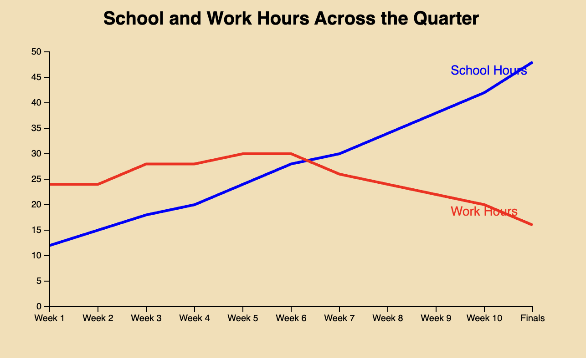

# School and Work Hours Across the Quarter

## Description
This project uses D3 to create a multi-line chart comparing weekly school hours and work hours during a college quarter.

The visualization shows how school hours steadily increase as the quarter progresses, especially near finals week, while work hours gradually decrease. The chart helps analyze how students balance academic responsibilities with paid work over time.

## Files
- `index.html` - main webpage
- `style.css` - chart styling
- `main.js` - D3 visualization code
- `student-time.csv` - dataset used for the chart
- `Line-Chart.png` - image preview of the final visualization

## Visualization Features
- Two line charts
- SVG paths created with `d3.line()`
- External CSV dataset
- X-axis for weeks
- Y-axis for hours
- CSS styling
- SVG title and labels

## Dataset
The dataset contains estimated weekly school and work hours across an academic quarter.

## Main Question
How does student time management change between school and paid work throughout the quarter?

## Preview

